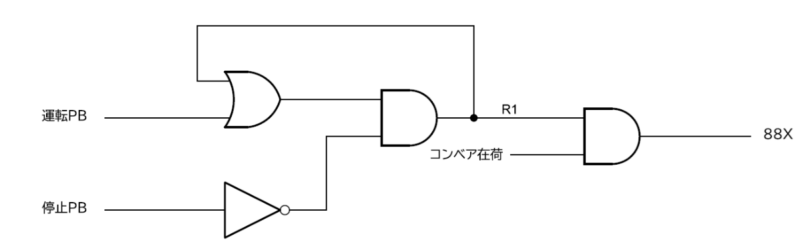
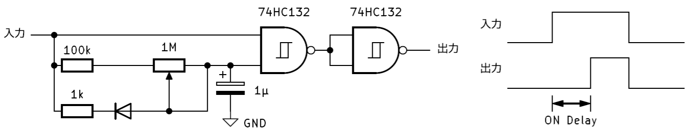

# PLCのつくりかた

<section id="preface">

# はじめに <!-- omit in toc -->

お手に取っていただき、ありがとうございます。

この本では、PLCを作ってみたので、その紹介をしたいと思います。ブログ記事とか長文を書くことがほとんどないので、うまく書けるかとても不安です……。

PLCをつくろうと思ったきっかけについて話したいと思います。工場でお仕事している人なので身近にPLCはあったのですが、最初からPLCをつくろうと始めた訳ではありません。

電子工作とかコンピューターとか興味あると、インターネットで自作CPUしてる事例に会うので自分も作ってみたくなりました。そこで、あの有名な「CPU<b>の</b>創りかた」を読みました。でも、TD4は理解できたけど、独自の命令セットを作ってその命令デコーダーの設計がわかんない、という感じでした。

じゃあ、その本で創っている4bitなCPUよりももっと単純なのを、ということで1bit CPUについて調べていたところ、MC14500BというPLCのために設計されたプロセッサを見つけました。ICU（Industrial Control Unit）という商品名でモトローラ社から発売された1bitプロセッサです。これなら、アイデアは真似させてもらうけど、自分で考えて作れそうって思ったのがきっかけです。

そういうことで、PLCのCPU部分の基本設計みたいなところはICUと似てます。I/Oは、工場でPLCを触ってた時の知見をちょっと使って設計しました。大手メーカー何社かのPLCを見たことありますが、だいたいどのメーカーも同じような設計になってましたね。

ジャンル的にも電子工作が中心で工場制御は知らないって方が多いかなと思いますので、まずはPLCって何ってところを解説しようと思います。その後でPLCの設計で考えたことを説明して、つくったPLCの動かし方を説明していきます。

2025年8月　みなぎ ゆう

</section>

<nav>

# 目次 <!-- omit in toc -->
- [PLCのつくりかた](#plcのつくりかた)
- [PLCとは](#plcとは)
  - [工場と制御](#工場と制御)
  - [展開接続図とラダー図](#展開接続図とラダー図)
  - [PLCと汎用コンピューター](#plcと汎用コンピューター)
    - [PLCの基本構成](#plcの基本構成)
    - [入出力](#入出力)
    - [処理](#処理)
    - [使い分け](#使い分け)
- [PLCの設計](#plcの設計)
  - [1bitコンピューターなPLC](#1bitコンピューターなplc)
  - [内部リレーとPIO](#内部リレーとpio)
    - [デジタル入力](#デジタル入力)
    - [デジタル出力](#デジタル出力)
    - [内部リレー](#内部リレー)
    - [タイマー](#タイマー)
    - [カウンター](#カウンター)
    - [アドレスデコーダー](#アドレスデコーダー)
  - [リセットとクロック](#リセットとクロック)
    - [リセット](#リセット)
    - [クロック](#クロック)
  - [プログラムメモリ](#プログラムメモリ)
  - [1bit CPU](#1bit-cpu)
    - [CPUのアーキテクチャ](#cpuのアーキテクチャ)
    - [Logic Unit](#logic-unit)
    - [ロードとストア](#ロードとストア)
    - [命令セットと命令デコーダー](#命令セットと命令デコーダー)
    - [動作タイミング](#動作タイミング)
    - [プログラムカウンター](#プログラムカウンター)
- [プログラミングと実行](#プログラミングと実行)
  - [要素名とアドレス](#要素名とアドレス)
  - [ラダー図からアセンブリ言語への変換](#ラダー図からアセンブリ言語への変換)
    - [LDとST](#ldとst)
    - [AND](#and)
    - [OR](#or)
    - [ANDとORが組み合わさった回路](#andとorが組み合わさった回路)
  - [プログラムの書き込みと実行](#プログラムの書き込みと実行)
    - [プログラムメモリの初期化](#プログラムメモリの初期化)
    - [プログラムの書き込み](#プログラムの書き込み)
    - [動作確認](#動作確認)
- [全回路図・部品](#全回路図部品)
- [おわりに](#おわりに)
- [参考文献](#参考文献)

</nav>

<section id="main">

# PLCとは

本書を読んでいただいている方は、電子工作したりコンピューター触ったりはするけど、PLCについてはなじみのない人も多いと思います。これから作るものがどういったものなのか、作る前に少し解説していきたいと思います。

## 工場と制御

工場では、製品を作るための製造ラインがあります。そこでは原料の加工をするための様々な機器が設置されていますが、てきとうに個別に動いていたのでは物を作ることはできません。機器同士の動きを結び付けて動作させることを制御といい、協調して動作している機器を制御系と言います。

制御には大きく分けて、算術演算を用いた制御と論理制御があります。前者は、炉の温度を一定に保つために、温度計からの温度によって燃料弁の開度を調整するようなPID制御などがあります。これは古くは真空管やトランジスタを用いたアナログ回路により実現されてきました。一般的に制御と言えば、こちらを指すことが多いと思います。

一方で、ベルトコンベア上に物が乗ってセンサーONでコンベアのモーターを動かして次工程に送るといった、機器を順序良く動かしていくシーケンス制御は主に論理制御となっています。論理制御は、リレーを使ったハードウェアによる回路で実現されてきました。

しかし、工場の機械化や自動化が進むにつれて制御対象が増えて回路規模が大きくなると保守が負担となり、操業方案を変更しようにもリレー回路の変更が必要となり労力がかかっていました。

そんな中で、プログラム内蔵方式のコンピューターが発明され、回路を変更しなくともソフトウェアの書き換えだけで演算の変更が可能になり、ICの発明により簡便に実現できるようになります。制御でもハードワイヤードな回路をソフトウェアに置き換えるため、産業用途の特殊環境に対応し、算術演算に特化したコンピューターとしてDCSが、論理演算に特化したコンピューターとしてPLC（Programmable Logic Controller）が開発されました。

この本では、この論理制御に特化したPLCをつくるので、制御というと論理制御（シーケンス制御）のことを指すことにします。

## 展開接続図とラダー図

リレーやその他の制御機器で組んだシーケンス回路は展開接続図という回路図で表します。

<figure>

<figcaption>展開接続図の例</figcaption>
</figure>

多くの展開接続図では上と下に電源となる母線があり、その間を縦でつなぐ線の間に制御用品の要素（スイッチや、リレーのコイル・接点など）が挟まっています。母線の上側が高電位側で24V電源の場合、P24や+24Vなど、下側が低電位側でN24やCOMなどと書きます。

<figure>

<figcaption>ラダー図の例</figcaption>
</figure>

PLCではラダー図というグラフィカルプログラミング言語を用いて、PLCへソフトウェアを書き込むためのプログラミングソフトウェア上へプログラミングしていきます。ラダー図は、左から右へ書いていくのが一般的な展開接続図とは違い、上から下に書いていきます。紙とは違ってパソコンの画面で操作するので上下スクロールの方が都合がいいからだと思います。左から順に要素を並べていき、一番右側がリレーのコイルといった出力、一番右以外はリレーの接点といった入力になります。PLCでは実際にリレーがいるわけではないので、出力は内部メモリや外部IOへの書き込み、入力は内部メモリや外部IOからの読み込みに相当します。

ラダー図で「| |」で示されているのはリレーのA接点（NO接点・常開接点）、「|/|」で示されているのがリレーのB接点（NC接点・常閉接点）です。「( )」で示されているのがリレーのコイルです。母線以外の線で繋がれて1つにまとまったラダーの部分をブロックと言います。

ラダー図はリレーで作った論理回路の書き方の一つなので、通常の論理回路で表すこともできます。電子工作する人たちにとっては、電子回路のこっちの方がわかりやすいかもですね。

<figure>

<figcaption>論理回路図の例</figcaption>
</figure>

このラダー図のままでは、コンピューターであるPLCは理解することができません。C言語など他のプログラミング言語と同様に、コンピューターが解釈できるような命令（機械語）に変換（コンパイル）しなければなりません。機械語にでき上ったソフトウェアは、USBなどを介してPLCのROMへ書き込みを行います。

論理回路から分かるように、ラダー図は演算と一致しているため、昔はキーボードがラダーの要素になっているプログラミングコンソールを用いてラダー図を直接書き込んでいく方法も取られていました。もっと昔は、人力でラダー図をPLCの命令と一対一になったアセンブリ言語に直してEPROM書き込み機に対してバイナリデータを入力し、書き込んだROMをPLCのDIPソケットに刺していたようです。古い工場ならPLCアセンブリが書いてある図面がのこっているかもしれません。このラダー図が演算と一致しているという特徴は、コンピューターで逐次処理されているプログラムが同時並行で起こっている制御へ逆変換できるということでもあります。

プログラミングにラダー図を使うのは、もともとリレー回路を構築する電気回路技術者が馴染みやすいからというのが元々の始まりだと思います。でも、プログラミングというとテキストベースの言語の方が一般的なので、PLCが出てきて何十年も経てばそっちに変わっていくかと思いきやそうではありません。筆者の考えになってしまいますが、工場は建設のときだけではなく、ずっと保全していくときのことを重視する必要があります。何か工場がトラブル起きて生産停止時には、早く復旧する必要があるので、トラブルシューティングしやすいようにしないといけません。グラフィックに表示されているラダー図は、論理式と論理の状態（ONなら要素に色塗りをする）を同時に表すことができます。ONしていない接点を迅速に見つけることができ、それがセンサーであれば取り替えにすぐ向かうことができるという、トラブルシューティングに優れているからというのも大きいと思います。

## PLCと汎用コンピューター

### PLCの基本構成

<figure>

<figcaption>PLCの外観（三菱電機 シーケンサMELSEC-Qシリーズ Webサイトより）</figcaption>
</figure>

PLCもデスクトップパソコンのように、電源やマザーボードやCPUといった機能ごとに部品が分かれています。しかし、パソコンケース内に収まっているデスクトップパソコンとは違い、PLCでは機能ごとにユニットという機器になっており外部からの取り換えや増設が容易になっています。

PLCで一般的なユニットとして、電源装置・CPU・入出力装置があります。電源装置はPLCの電子回路へ電源を供給するユニットです。AC100V～AC220Vの商用電源から電子回路の供給に適した3.3Vや5Vを生成しています。

CPUはPLCの頭脳にあたるユニットで、メモリに保存されたプログラムを読み出し、解釈し、実行（演算）していきます。古いPLCではメモリやタイマー・カウンターといった周辺機能が別のユニットに分かれていましたが、IC技術の向上した今ではCPUの中に含まれているのが普通です。入出力装置とはデータの流れ道であるバスで繋がっており、双方向にやり取りを行っています。

<figure>

<figcaption>PLCの構成イメージ図</figcaption>
</figure>

上図はPLCの構成イメージの図です。ラダー図がPLCの中にプログラムとして入っており、CPUはプログラムを実行しながら入出力を読み書きしています。外部の機器から見れば、PLCはリレーで組まれたシーケンス回路と同じように見なせます。

### 入出力

PLCと汎用コンピューターが大きく異なり、PLCがコンピューターとして特徴的なのが、入出力と思います。

汎用コンピューターでは、一部の組み込み用では直接機器を駆動させる用の入出力を持っていることがありますが、基本的には通信をするための入出力しかありません。パソコンを見てみると、イーサネット（LAN）ポートやUSBポート、映像出力ポートなどがあります。古いパソコンにはプリンタと通信するパラレルポート、マウスなどをつなぐシリアルポートもありました。どれも、ほかのデバイスと通信するためのポートになっています。しいて言うなら、ヘッドホン端子が直接外部の機器を動かすものでしょうか。

それに対して、PLCでは機器を動かすための入出力が主体になっています。PLCにも、他のPLCやコンピューターと通信するためのイーサネットやフィールドネットワークのためのポートを持っているものもありますが、PLCからするとごく一部になります。入出力を使ってランプやリレーを直接駆動できるようになっています。機器ごとに電位が違う場合があったり、機器同士で影響を及ぼしたりすることが無いように、入出力は各々が絶縁されています。

入出力装置はPLCから外部の制御対象機器へ接続するためのユニットです。よくPIO（Parallel Input Output）と呼ばれています。工場のたくさんの装置を接続し、装置ごとに電圧などの仕様が違えばそれでもユニットを分けるために、PLCの装置の中でほとんどの割合を占めるユニットとなります。PIOはデジタル入力（Digital Input、DI）、デジタル出力（Digital Output、DO）、アナログ入力（Analog Input、AI）、アナログ出力（Analog Output、AO）の4つに大きく分けられますが、制御で使われる大半はデジタル入出力（DIO）です。

デジタル入力では外部から電圧を印可してもらってフォトカプラを駆動し、絶縁されたフォトカプラのトランジスタ出力を読み込みます。AC入力できるDIではトランス絶縁のものもあります。

デジタル出力では、PLCからの出力をフォトカプラで絶縁し、フォトカプラの出力には外部機器にあった出力となるように駆動回路を設けます。DC出力であれば電流を増幅するためにパワートランジスタをつなぎ、AC出力であれば同様にトライアックをつないであることが多いです。ACでもDCでも使えて、漏れ電流もほとんど無くしたい場合には、フォトカプラの代わりに有接点のミニチュアリレーを使うこともあります。

アナログ入出力では、アナログデジタルコンバーター（ADC）やデジタルアナログコンバーター（DAC）を使って入出力しています。アナログの場合は直接絶縁するのが難しいので、デジタルに変換後に絶縁してあることが多いです。しかし、チャンネル間での絶縁が必要などの場合はとても高価となってしまいますが、絶縁増幅器を用いたものもあります。

以上のPIOのほかに、特殊なIOとして、カウンターユニットやシリアル通信ユニットなどがあります。高速すぎてスキャン処理のPLCでは処理しきれないものだったり、ソフトが複雑になりすぎたりするものはユニットとして分離されています。

### 処理

PLCもプログラム内蔵方式のコンピューターではありますが、パソコンやマイコンなどの汎用コンピューターとPLCなどを使ったデジタル制御コンピューターでは処理の考えに違いがあります。どちらも制御で使うのでリアルタイム性が求められるのは一緒です。

汎用コンピューターでは、ある処理の要求が来てから処理が完了するまでを短くするという考え方で処理を行います。IOポートの状態が変化したり通信で何かを受信したりすると、処理の要求をする割り込みが発生します。割り込みが来てからどれだけ早く処理に移れるか、処理に移ったらどれだけ短い時間でアクションを返せるかというのが大切になります。割り込み要求が複数同時に来た場合には、優先度を決定して優先度の高い物から処理をしていきます。また、複数のコンピューターで情報のやり取りをする場合、何か事象が起こればメッセージを伝送する方式を取ることが多いと思います。このように、汎用コンピューターでは直列処理をベースにリアルタイム性を実現しています。

<figure>

<figcaption>PLCの処理</figcaption>
</figure>

一方、PLCでのリアルタイム処理は、すべての処理をある期間内で終わらせようという考え方で処理を行います。もともとすべてのリレーが同時に動くリレー回路が置き換えられるように開発されていますからね。とはいえ、コンピューターなので逐次処理が基本で同時に論理計算をすることはできません。そこで、リレーや装置のセンサー・アクチュエーターの応答速度があるのに注目して、その時間内ですべての処理を行えば実質的に同時に処理を行っているように見せかけられる周期処理を採用しています。この周期的に実行する一連の処理をスキャンやサイクルといい、処理の最初に戻ってくるまでの時間をスキャンタイムと言います。PLC外への入出力も処理ごとに行うのではなく、スキャンの初めにすべての入力を同時採取し、スキャンの終わりにすべての結果を同時に出力へ書き込みます。

制御の現場ではいろいろな状況が同時多発的に発生し、それぞれが影響を及ぼしあっています。状況が発生するのが十数点なら割り込みでの処理が可能かもですが、大規模プラントだと数十万点にも及ぶ入出力を割り込みで処理していくというのは難しいです。フラグや入出力の状況を見ながら周期的に処理していくのが現実的です。また、周期処理では必ず1周期すれば状況にかかわらず処理を行えるので、安全上や装置が壊れるから装置を止めたい処理（インターロック）を必ず実施できるという利点もあります。直列処理だと高優先度処理が何らかの影響で突っかかったら、インターロックできなくなってしまいます。このように、PLCでは内部的には直列処理なものの、ある周期で見て並列処理をすることでリアルタイム性を実現しています。

### 使い分け

汎用のコンピューターが制御では使われないわけではなく、PLCとは階層構造をもって使い分けがされています。

<figure>

<figcaption>制御構造</figcaption>
</figure>

一番下の階層をフィールドレベルとかレベル0と言い、モーターや電磁弁などのアクチュエーター、圧力計やスイッチなどのセンサー、スイッチやランプなどの機器が該当します。機器の中には、マイコンが組み込まれていることがあります。

その上の階層を直接制御レベルとかレベル1と言い、各装置を制御する部分になります。レベル0の機器を直接動かし、シーケンス制御によって各機器の協調を取ったり保護したりします。制御にリアルタイム性や堅牢性が求められるので主にPLCが主に使われます。

レベル1の各装置をまとめて制御システム全体を見る階層がその上で、統括制御レベルとかレベル2と言います。ここでは、様々な大量データを収集して処理したり、予測計算をしたりする必要があるために、数値計算能力のある汎用コンピューターが主に使われています。

それより上の階層になると直接的に工場の制御にかかわってくることはなく、生産管理や需給とかを扱うようになります。ここでもコンピューターを使ったシステムが使われています。

# PLCの設計

PLCってどんなものか、だいたい解説しましたので、製作に入っていこうと思います。このPLCの名前は、筆者の名前と有名なPLCの名前からとって「MINASEC-U」にすることにしました。

PLCを構成するICにはマイコンやPLD(FPGA)は使わず、汎用ロジックICで作ることにします。ソフトウェアで処理を行うマイコンや、回路を書き込むPLDではICの中でどんなことをやっているのか分かりづらいですから。汎用ロジックICは、ANDやNOTなどのゲート回路だったり、数を数えるカウンターだったり、単機能で動作も分かりやすいICです。ここでは、汎用ロジックICでもよく使われている74HCシリーズから選ぶことにしました。CMOS構造で消費電力が少ない、DIPパッケージがあって手で扱いやすい、お店で手に入りやすいといったメリットがあります。そのほかに、メモリICやリセットICも使っていますが、いずれも単機能なICです。回路の電源電圧はロジック回路で一般的な5Vとします。

抵抗器やコンデンサはE系列という決まった値の部品が用意されています。E系列には、1桁あたり3つの値が用意されているE3（1.0, 2.2, 4.7×10n）、6つのE6（E3に1.5, 3.3, 6.8が追加）、E12、E24…とありますが、使われる頻度が多いE3系列の値からなるべく選びました。そのほかの部品も、生産終了した部品を選んだものもありますが、入手性の良いか汎用的なものを選ぶようにしました。

## 1bitコンピューターなPLC

今回作るPLCは、ラダー図で書かれたリレーの論理回路を処理できるだけの単純なPLCとします。PLCではラダー図の要素を一つずつ順に、リレーのONとOFFを見ながら処理していきます。多くの桁がある数値を演算する汎用コンピューターと違い、2つの状態しかありませんから演算は1bitごと行えば大丈夫です。よって、PLCは1bitの演算ができる1bitコンピューターって訳です。

コンピューターが何ビットアーキテクチャなのかを表すのに、一度に計算できるビット数（データバス幅）を使うのか、直接扱えるデータ量（アドレスバス幅）を使うのかなど流派がありますが、ここでは一度に計算できるビット数とします。もちろん、リレーが2つだけしか扱えないのでは意味がないので、1bit CPUとはいってもアドレス幅は違います。

本PLCのブロック構成図を示します。大きく分けて4つの要素から構成されており、各要素はバスと呼ばれる配線によって接続されています。

<figure>

<figcaption>MINASEC-Uブロック図</figcaption>
</figure>

プログラムメモリは、コンピューターがどのように動くかを示したプログラムを記憶しています。プログラムはCPUの処理を決める命令が並んでいます。1つの命令には、CPUの処理内容を決める部分（オペコード）と、CPUがどのデータを処理するかを決める部分（オペランド）があります。

CPUはコンピューターの中で演算などの処理を行います。データバスにあるデータを読み取って演算後にデータバスに書き戻します。CPUの中には、プログラムカウンター（Program Counter、PC）があり、プログラムメモリに格納された命令を順次読み出すためのカウントを行います。PCのカウント値は命令アドレスバスに出力され、そのアドレスのメモリに保存されている命令が命令バスに出力されます。

I/O（Input/Output）は、CPUに対して処理するデータを入力したり、計算したデータを出力したりするブロックです。データメモリは処理の途中データを記憶しておきます。このようなCPUからデータを受け取ったり渡したりする要素を、周辺デバイスとか単にデバイスと言います。

プログラムメモリからCPUへは命令を送るための命令バス、プログラムメモリからI/Oやデータメモリへはデータを読み込むか指定するアドレスを送るアドレスバスがあります。いずれも2進数の値が配線上を流れています。I/OやデータメモリとCPU間は、CPUで処理されるデータ送られるデータバスがあります。一般的なCPUのデータバスでは、CPUへの入力とCPUからの出力で同じバスを共有している双方向のバスです。共有していると配線の削減のメリットがあるのですが、CPUが入力している時と出力している時で、データがぶつからないようにタイミング制御を考えないといけないです。今回はデータバスが1本（1bitなので）だけで入出力を分けても1本増えるだけです。シンプルにできるように入力データバスと出力データバスは分けることとします。

図中には書いていないですがそのほかにも、CPUからのタイミングを伝えたり、デバイスの動作を変えるための信号を送ったりする制御バスがあります。本PLCでは制御信号として、デバイスの初期化を行うクリア・リセット信号、デバイスが出力データバスから読み込むタイミングを伝えるWE信号、IOが取り込みや更新を行うタイミングを伝えるスキャン信号があります。

## 内部リレーとPIO

コンピューターを作る本なのに、CPUの話からじゃなくてI/Oの話から始めます。PLCってCPUよりもI/Oがメインなんじゃないかって思うくらい、I/Oが占める割合が大きいんですよね。

リレー回路では全てハードワイヤーで配線するので、すべてのリレーの接点は外部からでも接続することができます。しかし、リレーで組まれた制御回路でも外部の機器から入力したり出力したりするリレーは一部だけで、大半のリレーは制御回路のリレー同士をつなぐだけで使用されています。そこでPLCでは、外部の機器とつながるコイルや接点にあたるリレーを入出力としておき、内部で使用するリレーは励磁の状態をデータメモリ上に保持しておくことにします。

PIOの入出力電圧は一般に使われている24Vを扱える仕様とします。ノイズ耐性を考えると電圧が高い方がよく、昔は48Vが多く使われていたようです。現在ではノイズ耐性と経済性のバランスが取れている24Vが多くなっています。

### デジタル入力

デジタル入力（Digital Input, DI）では外部から入力された電圧を入力データバスへ送ります。多数の入力からアドレスで指定された入力のデータのみを、データバスに送らないといけません。そのためのICとして、データセレクタやマルチプレクサと呼ばれるものがあります。切り替えスイッチみたいなものです。

<figure>

<figcaption>74HC251のピンアサインと真理値表（東芝データシートより）</figcaption>
</figure>

ここでは74HC251という型番のICを選定しました。74HC251は、8つのデータ入力端子と3つのアドレス入力端子があり、アドレスで指定された位置の信号が出力されます。そのほかにストローブ入力があり、Hにすると出力がハイインピーダンス状態になります。マルチプレクサは、長辺がデータ入力側で短辺が出力側、斜辺にはアドレス入力とした台形の記号で表すことがあります。

ハイインピーダンス状態とは、L(0V)でもH(5V)でもないOFFの状態のことです。こういう出力ができる端子のことをスリーステート出力といいます。バスにたくさんのI/Oなどのデバイスがつながっている時に、LになっているものとHになっているものがいたらショートしてしまいます。各デバイスの出力をスリーステート出力の端子にして繋げておけば、バスに信号を出力したいものだけがLもしくはHの出力することでショートを防げます。こうすることで、マルチプレクサを使わずとも選択した信号だけをバスへ出力できます。バスもマルチプレクサのICを使う手もあるのですが、部品が増えたり繋ぐデバイスが増えるごとにマルチプレクサの入力を増やしたりしないとなので面倒です。注意点として、出力の切り替わりの瞬間などでバスに出力しているデバイスがすべてOFF状態になるとバスの値がLでもHでもない状態となります。バスに対してプルダウン抵抗かプルアップ抵抗を追加して論理値を固定するようにします。

<figure>

<figcaption>スリーステート出力で構成したバスの模式図（□が各出力デバイス）</figcaption>
</figure>

外部からICへは、フォトカプラで絶縁した後、ローパスフィルターを通してシュミットトリガで信号を整えます。下図が今回設計した入力部の回路です。

<figure>

<figcaption>デジタル入力回路</figcaption>
</figure>

外部端子に24Vを入力した際の電流は10mA程度とする必要があります。電流が少ないと、スイッチやリレーなど有接点の機器をつないだ場合に、接点の接触の信頼性が問題になります。大容量を開閉できるものは最小電流も大きいですが、操作用品で使われるスイッチや制御用リレーの場合は最小電流が数mA程度となっています。余裕を見て10mAくらい流すのがよいという訳です。（余談ですが、市販のPLCでは8点から32点入力といった点数違いのDIがあります。多点入力のものは入力電流が小さいためカムスイッチなどの大型スイッチで信頼性の問題になったりします。入力点数が違うだけじゃないんですよね。）今回使ったPC817というシャープの有名なフォトカプラのLEDの順方向電圧は1.2V標準となっています。よって、LEDに直列に繋がる入力抵抗には、(24V-1.2V)÷10mA=2.3kΩとなり、抵抗のラインナップで近い値の2.2kΩを選びました。

<figure>

<figcaption>入力回路の素子の値の決定</figcaption>
</figure>

LEDに並列に繋がっている抵抗はノイズや漏れ電流による誤入力の防止用です。2線式の近接センサーにはOFF時に1mA程度の漏れ電流がありますし、誘導ノイズでちょっと電圧が乗って電流が流れてしまったときに、PLCの入力がONと認識しては困ります。LEDは順方向電圧より大きい電圧を加えた時に光るので、1mAの入力では順方向電圧より十分に小さな電圧（例えば半分）にしておけば良いです。1.2Vの半分の0.6Vのときに1mA以上を流すには、0.6V÷1mA=600Ω以下となり、近い値として470Ωを選びました。LEDが光るギリギリ1.2Vのときは1.2V÷470Ω=2.6mAくらいがこの抵抗に流れます。入力抵抗にかかる電圧は2.6mA×2.2kΩ=5.7Vとなるので入力には1.2V+5.7V=7Vより十分に大きい電圧をかけないとPLCはきちんとONって認識しないことになります。

ダイオードは、逆に電圧がかかった時のために入力保護用でつけています。

フォトカプラのLEDに電流を流した時にトランジスタに流すことのできる電流の比を、電流伝達比（CTR）といいます。CTRは素子によってばらつきがあるのでランク分けして売られています。少しの電流でも大きな電流を開閉できるCTRが大きいものが良いのですが、CTRの大きなランク品は値段も高くなっています。一般的なものは最小CTRが100%（例えばLEDに5mA流せば、トランジスタは5mAを開閉できる）かなと思います。今回の回路でLEDに流れる電流は、入力抵抗に流れる10mAから、並列に繋がった抵抗に分流する2.6mAを引いた7.4mAです。よって、トランジスタに流せる電流は7.4mAまでなのですが、これは室温で新品の時の値です。

<figure>

<figcaption>相対電流比－周囲温度特性(シャープPC817データシートより)</figcaption>
</figure>

上図のように周囲温度が上がるにつれてCTRは低下し、50℃のときには70%強くらいになっています。また、データシートに記載がある通り「フォトカプラに使用している赤外発光ダイオードは一般的に通電により発光出力が低下します。長時間使用の場合は赤外発光ダイオードの出力低下（50%／５年）を考慮し回路設計願います。」ということで低下を見込んで設計する必要があります。今回は、劣化しても7.4mA×70%×50%=2.6mAまではトランジスタに流せるとすることにしました。次にトランジスタのコレクタにつないだプルアップ抵抗の値を考えます。トランジスタがONしたときに出力がちゃんとL(0V)にならないといけません。電源電圧が5Vなので、5V÷2.6mA=1.9kΩ以上の抵抗値が必要で、近い値として2.2kΩを選びました。それ以下だとトランジスタ側に電圧が残ってしまってLまで電圧が落ちません。

<figure>

<figcaption>チャタリング除去回路</figcaption>
</figure>

有接点の機器からの入力にはチャタリングという現象が起こります。チャタリングとは接点が閉じたり離れたりするのに瞬時に1度だけじゃなく、何度かON, OFFを繰り返す現象です。チャタリングの継続時間は数msから10msくらいなので人間にしてみれば一瞬だし、リレー回路でもリレーの接点が動く時間があるので気にならないのですが、高速で動く電子回路からすると問題になります。手の力や電磁石の力で接点をくっつける（スイッチやリレーのA接点がON）ときはその力があるので短めなのですが、接点をばねの力で戻すとき（A接点がOFFやB接点がON）の時は長めの傾向があります。対策として、RCフィルターによるローパスフィルターがよくつかわれます。ON, OFFの繰り返しはフィルターによって除去されますが、波形がゆっくり変化するようになってしまいデジタル回路にとってLなのかHなのか微妙な時間ができてしまいます。シュミットトリガというON→OFFとOFF→ONでしきい値電圧の違う入力を持ったICを使うことで瞬時にON, OFFが変化するように整形してやります。シュミットトリガ入力のインバーター（NOT）回路ICの74HC14を使います。インバーターを使ったのは、先ほどのフォトカプラの出力で反転してしまっている（外部がONのときにLになっている）のでちょうどよいのと、シュミットトリガ入力のバッファ回路ICが一般的じゃないんですよね。ローパスフィルターの時定数は、想定されるチャタリング時間から10msとしました。10kΩ×1µF=10msです。

これで外部の機器から入力バスへ信号を流し込むデジタル入力回路がほぼ完成しました。しかし、入力が変化するたびにバスにある信号の値が変化してしまいます。PLCでは1スキャンごとにラダー図の処理を行う都合上、スキャン中に信号が変化してしまうのは困るので、スキャンの切り替わりで入力を採取する必要があります（1-3-3　参照）。そこで、クロック入力の立ち上がりでデータを保存して、それ以外の時は保存時のデータを保持する、D-フリップフロップ（D-FF）をマルチプレクサへの入力に追加します。CPUからスキャンの切り替わり時にD-FFへクロックを与えれば、1スキャン中は入力の状態を保ったまま処理を行うことができます。D-FFには8回路入りの74HC273を使いました。このICにはリセット入力があり、リセット入力にLを入力すると保存を破棄して出力値をLにします。PLCの電源を入れた後などは値が不定になってしまうのでこのリセット入力を使うことにします。

<figure>

<figcaption>74HC273（東芝データシートより）</figcaption>
</figure>

デジタル入力回路の1回路分は以下のようになりました。

<figure>

<figcaption>デジタル入力回路</figcaption>
</figure>

### デジタル出力

デジタル入力（Digital Output, DO）では出力データバスの信号を外部の機器へ送ります。データバスからの信号をどの出力へ出すかは、入力と同様にアドレスで指定します。入力とは逆に切り替えスイッチを逆にしたようなデマルチプレクサを使えば、ってするとアドレスで選択されている出力はバスの信号が出るのでいいのですが、アドレスを切り替えた瞬間にせっかく出力した信号が消えてしまいます。アドレスで指定した出力にはバスの信号が出力されて、それ以外の出力はそのままにしてくれる、そういう機能のICをアドレッサブルラッチといいます。デマルチプレクサの出力に情報を記憶するラッチがついた構造になっています。D-FFもラッチも状態を保持してくれるのは一緒なのですが、D-FFはクロック入力の変化で、ラッチはゲート入力Gの状態で保持とタイミングが違います。アドレッサブルラッチICの74HC259は、8つの出力から3つのアドレス入力端子で選ばれた1つへ、ゲート入力端子がLのときにデータ入力端子の信号を書き込みます。選ばれていない他の端子は前の状態を保持したままです。そのほかに、Lにすると保持しているのをすべて破棄するクリア入力端子があります。なお、アドレッサブルD-FF ICは汎用ロジックICのラインナップになさそうでした。

<figure>

<figcaption>74HC259（東芝データシートより）</figcaption>
</figure>

アドレッサブルラッチから出力した信号は、フォトカプラで絶縁して、トランジスタで流せる電流を増幅してから外部へ繋げるようにします。

<figure>

<figcaption>外部接続部分</figcaption>
</figure>

フォトカプラのLEDには劣化後の状態を考慮してなるべく多く電流を流しておきたいのですが、ICの出力可能電流に注意する必要があります。74HCシリーズのIC出力端子の最大電流定格は1出力あたり25mA、全部の合計で50mAくらいです。最大定格は壊れてしまう時の値なので、余裕をもって半分くらいにしておくことにします。8点すべてがH出力だった時に最大の電流となるので、25mA÷8=3.1mAまでとします。電源は5Vなので、LEDへの電流制限抵抗は(5V-1.2V)÷3.1mA=1.2kΩ以上ないといけません。次に大きな抵抗値の2.2kΩを使うことにします。よって、フォトカプラのトランジスタが開閉できる電流は劣化など考慮した最小値で、(5V-1.2V)÷2.2kΩ×70%×50%=0.6mAとなります。

PLCの外部にはリレーが接続されることを想定して、リレーのコイルを動かせるだけの電流が流せるようにします。制御用の小型パワーリレーでも50mA程度はあるので、0.6mAじゃぜんぜん足りません。そこでトランジスタを使って増幅することにします。1チャンネルごとにトランジスタを用意してもいいのですが、複数のトランジスタが入ったトランジスタアレイという便利な部品があります。TBD62084Aは50Vで500mAまで流せる8つのトランジスタ（MOSFET）とクランプダイオードが入ったトランジスタアレイです。これは入力が12V回路用で、同じシリーズでTBD62083Aという5V回路用のものもあります。入力端子に7V以上の電圧をかけるとトランジスタがONし、その時の入力電流は最大0.5mAとあります。フォトカプラで開閉できる電流以下で使えるのでちょうど良いですね。

<figure>

<figcaption>TBD62084A（東芝データシートより）</figcaption>
</figure>

クランプダイオードというのは、コイルなどの誘導性負荷を駆動したときに発生する逆起電力の高電圧を逃がすための部品です。コイルは電流をずっと流し続けたい性質を持っているので、急にOFFにしてしまうと無理やり電流を流そうとして高電圧を発生させて、周りの部品を壊してしまいます。OFF後もクランプダイオードでコイルを回る電流が流れるようにすることで高電圧を逃がしてやります。

外部回路は24VですがTBD62084Aの入力に24Vを印可すると壊れてしまいます。昔はTD62082Aという24V用のトランジスタアレイもあったのですが、廃止になってしまいました。24Vから12Vをつくるために電源回路を追加します。よくあるツェナーダイオードとトランジスタを使ったシリーズレギュレーターの回路です。

<figure>

<figcaption>レギュレーター回路</figcaption>
</figure>

これで、バスから外部までの出力回路はできました。しかし、1スキャンの処理中に処理途中の信号が外部出力されてしまう問題があります。DIと同様に外部と繋がる前の部分、アドレッサブルラッチの出力にD-FFを通してから出力するようにします。D-FFのクロックは、スキャンの切り替わりタイミングで立ち上がりを入力します。

また、出力の状態をラダー図で参照することもあります。アドレッサブルラッチの出力にマルチプレクサを接続して入力データバスへ読み込めるようにします。DIと違って外部の回路を接続する必要も、接点がないのでチャタリングが発生する可能性もないので、絶縁やローパスフィルターは不要です。

デジタル入力回路の1回路分は以下のようになりました。

<figure>

<figcaption>デジタル出力回路</figcaption>
</figure>

### 内部リレー

外部の機器を駆動しないラダー回路の処理中に一時的に使用するリレーは、PLCの内部だけで入出力できればよく、絶縁回路などは不要です。この、外部の機器を駆動しないラダー回路上でのみ使用する仮想的なリレーを、内部リレーとか補助リレーと言います。内部リレーは、コイルが励磁されているのかしないのかをメモリ上に記憶します。メモリにはリレーでいうコイル励磁の状態の状態を保持しておけば、メモリはいつでも何度でも読み込めるので無限に接点のあるリレーになれます。メモリICの例として日立のHM6267は1bitの値を16384個記憶できるRAMで、古いPLCによく使われていました。小さいICでリレーが1万個以上も再現できるのですごいですね。

<figure>

<figcaption>HM6267のブロック図（日立データシートより）</figcaption>
</figure>

今回のPLCでは小機能のPLCで点数がたくさんいらないためRAMは使わずに、DOと同じようにアドレッサブルラッチ74HC259とマルチプレクサ74HC251を組み合わせて内部リレーとしました。1bitのRAMもずいぶんと前に製造中止になってしまっており入手するのも困難です。

<figure>

<figcaption>内部リレー回路</figcaption>
</figure>

### タイマー

タイマーリレーやタイマースイッチは、入力信号が入ってから一定時間後に出力信号を変化させる機器です。シーケンス制御で使われるタイマーリレーは、通常のリレーと同じ形状になっていてリレーと差し替えて使うことができます。コンベア上に製品を載せて運ぶとき、載せてセンサーがONした瞬間にコンベアが回り始めると危ないので、センサーONから1秒後に動かすように遅延させるときなどに使います。代表的なタイマーリレーには、OFFからONするときにONが遅れて出てくるONディレイタイマーと、ONからOFFするときに遅れてOFFするOFFディレイタイマーの2種類があります。そのほかにも、一定時間だけONするものや、一定時間でON, OFFが繰り返されるものがあります。もっともよく使われるのはONディレイタイマーです。

PLCにもタイマーリレーと同じ役割を持つタイマーという機能を持っています。今どきのPLCだとタイマーの時間をソフト的に決定することができますが、昔のPLCだとハードウェアで遅延回路が組んでありました。今回のPLCもRC遅延回路で実装しようと思います。実装するのはONディレイタイマーだけとします。OFFディレイタイマーやほかのタイマー機能もONディレイタイマーがあればラダー回路で組むことができます。

<figure>

<figcaption>オンディレイ回路</figcaption>
</figure>

上に示すのがCMOSロジックを使った遅延回路です。チャタリング防止に使ったローパスフィルターとほとんど同じですね。時定数は可変抵抗器を使うことで変更できるようになっています。ONディレイかつOFFディレイにはしたくないので、入力がOFFしたときに瞬時にOFFになるようにAND回路を使い、コンデンサの放電を早くするためのスイッチングダイオードと低い抵抗値の抵抗を入れています。シュミットトリガ入力のANDゲートICは無いので、シュミットトリガ入力NANDの74HC132を使うことにします。NAND回路とNANDで作ったNOT回路をつなぐことでAND回路としています。

この回路を、内部リレーとして使った74HC259と74HC251の間に入れることで、ONが遅れた信号を読み出すことができます。100kΩ×1µF=0.1sから(100kΩ+1MΩ)×1µF=1.1sが計れるタイマーと、コンデンサの値を10µFとして1s～11sまで計れるタイマーの2つを用意しました。

<figure>

<figcaption>タイマー回路</figcaption>
</figure>

### カウンター

カウンターは、入力信号の変化を数えて表示し、設定した数になると出力が変化する機器です。リレーで論理回路をつくれてフリップフロップも構成できるので、リレー回路だけでカウンターを作るのもできます。でも、かなり大変なので専用の機器が用意されています。

PLCも同様にカウンターが用意されている機種が多いです。代表的なカウンターの動作は、クロック入力の立ち上がりで1つ数が増え、設定した数値と一致したらカウンターからの出力がONするというものです。一致した場合は立ち上がり信号を入力してもそれ以上の計数はされません。カウンターにクリア入力を入れると計数が0になります。

カウンターの機能をブロック図で表すとこのようになります。クロック入力にクロックを入れると出力の数値を増やしていく（狭義の）カウンター回路があり、出力に表示回路をつないでカウンターの値を表示します。カウンターの値と設定した値を比較して一致していたらONする比較一致回路からの出力をカウンター機能の出力とします。カウンターのクロック入力は、比較一致回路の出力の反転値とANDをとることで、一致していないときのみカウントアップできるようにします。

<figure>

<figcaption>PLCのカウンター機能</figcaption>
</figure>

74HCシリーズにはたくさんのカウンターICがあるのですが、表示回路では10進数で表示したいのでBCDカウンターから選びます。バイナリカウンターだと2進数となってしまい、読みにくいのです。BCDは10進数の1桁を2進数の4桁ずつで表す手法で、簡単に10進表示することができます。0～9までだとちょっと寂しいので、0～99まで数えられるようにしようと思います。74HC390はBCDカウンターが2回路入ったICで、今回の用途にぴったりです。

<figure>

<figcaption>74HC390（東芝データシートより）</figcaption>
</figure>

74HC390は実際には2進カウンターと5進カウンターで分かれており、10進とするには、2進出力QAと5進入力CKBをつなぐ必要があります。さらに、99まで数える100進カウンターとするために、1回路目のQDと2回路目のCKAを接続します。クリア入力は計数をクリアして0にします。注意点として、クロックの立ち下がりでカウントアップになりますので、反転して入力する必要があります。

<figure>

<figcaption>4511B（東芝データシートより）</figcaption>
</figure>

カウンターICの現在のカウント値は、7セグメントLEDに表示することとします。BCDを7セグメントLEDに表示するICとして74HC4511があります。4000/4500シリーズCMOS ICの4511Bを74HCシリーズに移植したICなので、4511Bを使っても同じです（こっちの方が入手が容易）。A～DがBCD入力、a～gが7セグメントLEDへの出力で、カソードコモンの7セグメントLEDを直接点灯できます。LT, BI入力はBCD入力と無関係に全点灯・全消灯します。BCD入力にはラッチが入っており、LEがLのときだけ表示が変化し、Hのときは保持します。単純にBCD表示するのにしか使わないので、LT, BIはH固定、LEはL固定とします。

<figure>

<figcaption>4511Bを使った7セグメントLED表示回路</figcaption>
</figure>

カウント値の設定にはロータリーコードスイッチ（DIPロータリースイッチ）を使います。設定できる数値によっていろんな種類がありますが、使うのは0～9までのBCDタイプです。スイッチのつまみを数字に合わせると、4つの接点のうち数字に対応した2進数がONする優れものです。形状は違うけど同じ機能を持ったスイッチに、デジスイッチがあります。

<figure>

<figcaption>ロータリーコードスイッチの接点</figcaption>
</figure>

比較一致回路にはBCD×2の8ビットを比較できる回路が必要となります。74HC688は、P0~P7入力に与えられた8ビットの信号と､Q0~Q7入力の信号が一致したときに比較出力P=QがLになる機能を持ったICです。G入力は数値にかかわらず比較出力をH（不一致）とします。P入力にはカウンターの出力を、Q入力にはロータリーコードスイッチの接点をプルダウンしたものを入れます。74HC688は一致でLになっているので、一致でHとするために出力をNOTで反転します。逆にカウントさせないようにクロック入力へ繋ぐ方はNOTが不要になります。

<figure>

<figcaption>74HC688（東芝データシートより）</figcaption>
</figure>

でき上った回路は、タイマーのときと同じように74HC259と74HC251の間に入れることで、カウントアップ・クリアの出力と、カウント一致の入力としてCPUが使うことができます。出力が2つで入力が１つなので、1つ入力が余ってしまっています。これはL固定にしておくことで常時オフビットとしても使えるようにしました。

<figure>

<figcaption>カウンター回路</figcaption>
</figure>

ところで、PLCのカウンターの値はPLCの電源を切っても保持されているものが多いと思います。上記の回路のままだと電源を切ったらカウントの値が失われてしまいます。リアルに近づけるためにカウント値の保持も実装しようと思います。そのためには、カウンターICの74HC390だけ電源を切らなければ実現できます。動作中は主電源から供給し、電源が落ちた後は電池などから供給することにします。こういう手法をバッテリーバックアップと言います。74HCシリーズはCMOS技術で作られているので、非動作時の消費電力はµAオーダー以下でほとんど消費せず、バックアップに最適です。今回は電池交換がいらないように、コンデンサにしては大容量の電気二重層コンデンサをバックアップ用電源に使いました。電池に比べて自己放電が大きく、容量も小さいので、余り長期間の保持には向きません。

74HC390は電源が入ったままになるので、カウント値の出力もされっぱなしになります。これを電源の切れている他のICに繋ぐと壊れてしまいます。ICは電源電圧よりも高い電圧を入力端子にかけることができません。74HC390の出力には、同じくバックアップ電源で動かす74HC541というスリーステートバッファを入れることにします。バッファなので入力をそのまま出力に出すのですが、G入力をHにするとハイインピーダンス（Hi-Z）になり出力されなくなります。主電源が切れている時にはGをHにしておけば解決です。

<figure>

<figcaption>74HC541（東芝データシートより）</figcaption>
</figure>

入力の方も問題があり、74HC390はいつでも動作できる状態になっているので、主電源がON, OFFする瞬間の他のICが不安定なときに、誤ってカウントアップやリセットされてしまう可能性があります。そのため、同じくバックアップ電源で動かすNANDゲートを各入力へ入れておき、主電源がOFFのときはHもしくはLへ固定しておきます。RST信号が主電源OFFのときにHになり、RST信号はLになるようにしています。

デバッグの際には手でカウント値のクリアをしたいので、カウントクリアのスイッチも付けることにしました。バックアップ電源のコンデンサの放電用も兼ねています。電池だと電池ホルダーから抜けばいいのですが、コンデンサの場合はできないので回路をいじりたいときに押しっぱなしにして放電します。

設計したカウンター回路の全体は巻末の回路図を見てください。

### アドレスデコーダー

CPUがどの位置のDIや内部リレーの読み書きするかはアドレスバスによって指定します。そのとき、アドレスを読み取って、アドレスが一致したらデータバスに対してデータを出力したり、データバスからデータを読み取ったりを指示する回路が必要になります。このようなアドレスによって動作を制御する回路をアドレスデコーダーと呼びます。

すでにデバイス単体のなかでは、アドレスデコーダー的な動作はしています。74HC251だったら3ビットのアドレスで8つの入力からどれを選ぶか決めていますし、74HC259も同様に8つの出力のどれを選ぶか決めています。ここでは、各デバイスを複数バスにぶら下げたときの、各デバイスへのアドレスの制御を考えていきます。デバイス内の3ビットとは別に、デバイスを選ぶビットをアドレスに用意します。

<figure>

<figcaption>アドレスバスの構成</figcaption>
</figure>

1つの手法として、各デバイスに自分のアドレスを設定して、デバイス側で設定値と一致しているかを判断してもらう方法があります。大型のPLCだとI/Oユニットの前面にロータリーコードスイッチがあって、ユニットのアドレスを設定できるようになっていると思いますが、それと同じやり方です。DIの時はアドレスが一致していたらストローブ入力をLにして、DOのときはアドレスが一致していたらCPUからの書き込み信号でゲートをLできるようにしておけば良いですね。

<figure>

<figcaption>各デバイスでアドレスデコードする方式</figcaption>
</figure>

別の手法として、アドレスのデコードは別でやってしまって、各デバイスに指定されたよという信号のみを渡す方法です。2進数で指定されているアドレスから、対応した1つの出力だけをLにする回路を用意して各デバイスに1本ずつ渡せば、各デバイスに

アドレス比較回路が不要になります。こういう機能の回路のことを文字通りデコーダーと言います。メリットとしては比較回路が要らないので、デバイス数が少ないときは回路規模を抑えられます。逆にデバイス数を多くしようとすると多出力のデコーダーを用意しないといけないし、配線量も大量になります。2進数のアドレスバスなら8本あれば256個のデバイスを指定できますが、デコード後だと256本も配線を引かないといけません。

<figure>

<figcaption>一括でのアドレスデコード</figcaption>
</figure>

今回は後述のプログラムメモリの関係上、デバイスを4つだけとすることにしたので、回路が簡単になる後者で作りました。8点DI、8点DO、8点内部リレーと、8点の内部リレー兼タイマー兼カウンターです。デコーダーのICには74HC138を使用します。A, B, Cの3つのアドレス入力から選択されたY出力のみをLにするぴったりな機能を持ったICです。イネーブル入力G1はL、2つのG2はHにすると、アドレスに関係なく全Y出力をHにすることができます。イネーブル入力は、カスケード接続してさらに多くのアドレスをデコードするときに便利なのですが、今回は4点だけデコードできればいいので使用しません。G1をH固定、G2をL固定にして、4デバイス（2進数で2桁）だけなのでアドレス入力CをL固定にして、上図のデコーダーのところにこのICを付ければアドレスデコーダーができました。

<figure>

<figcaption>74HC138（東芝データシートより）</figcaption>
</figure>

ところで、アドレス一致でLかつ書き込み信号がLで、74HC259のゲートがLになるようにしています。そして、74HC138は8点デコードできるのに4点しか使ってなくてもったいない気もします。書き込み信号を74HC138のC入力に繋いでみたら、Y0～Y3はアドレスA, B一致かつCがLでLになるようになっていますね。ということで、ちょっとずるして各ゲートのORを省略して、74HC138へ書き込み信号のデコードまでさせることにしました。書き込み信号がLの間は同じデバイスの読み込み側がLにならないのですが、書き込みと読み込みをCPUが同時に行わないのであれば支障ありません。

## リセットとクロック

### リセット

リセット信号はコンピューターの動作を止めて初期化するための信号です。手動でコンピューターの動作を一からやりたいときもあるかもしれませんし、電源を入れた直後は綺麗な状態で処理を始める必要があります。他にもICの動作可能電圧より電源が下回ったら、変な動作をしないように止めておいた方がよいでしょう。下図は、リセット信号をスイッチと電圧監視で発生させるようにした回路です。

<figure>

<figcaption>リセット回路</figcaption>
</figure>

スイッチも有接点なのでチャタリングが発生します。220kΩと100nF（0.1µF）のローパスフィルターを通した後にシュミットトリガで波形の整形をしています。

シュミットトリガの入力の直前についているのがリセットICです。リセットICは電源の電圧を監視して、基準電圧以下になっていたら出力をLにする機能をもっています。このICによって電源が低下した際には瞬時にLとなり、リセットをかけれるようになっています。逆に、電源が基準電圧以上になると、リセットICの出力はOFFになって電圧が上がりますが、スイッチのローパスフィルターを通しているので、遅れてリセットが解除されます。

ほかのスイッチ入力は100kΩと100nFでフィルターをかけていますが、リセットは少し長めにすることで電源投入直後の不安定な状態を過ぎ去ってからリセット解除されるようにします。

回路図中の信号名表記では、バッテリーバックアップ系につかうリセット信号をRST、メイン電源系に使うリセット信号をCLRとしています。

### クロック

コンピューターの中の回路はクロックというH, Lを繰り返す信号でタイミングを合わせて動いています。クロック信号の立ち上がりもしくは立ち下がりで、一斉になんらかの処理を行っています。クロックを止めればコンピューターの処理を一時的に止めることができます。

クロックは早い方が時間当たりたくさんの処理をすることができます。PLCも1スキャンを十分に早くすることでリアルタイム性を持たせていますから、1スキャンが短ければよりリアルタイムに制御できるわけです。今回は自作PLCなので、メインの速いクロック（30kHzくらい）に加えて、逐次処理しているのが目視で確認できる1Hzくらいの遅いクロックと、手で1つずつ処理を進めることができるように手動のクロックも用意します。

<figure>

<figcaption>74HC4060のピンアサインとシステム図（東芝データシートより）</figcaption>
</figure>

74HC4060はクロックを作るための発振回路と、クロックを遅くするための分周回路が1つになったICです。D-FFのデータ入力に反転データ出力をつなぐと、クロックの立ち上がりの度に出力の信号が切り替わる回路になります。よって、D-FFの出力を見るとクロックの半分の速さのクロックが出てきます。これが14段つながっているので、最大214=16384分周されたクロックを得ることができます。

<figure>

<figcaption>クロック発生回路例（東芝データシートより）</figcaption>
</figure>

D-FFの前の段にあるインバーターなどが発振回路です。上図のデータシートの例のように繋ぐとクロックを発生させることができます。

このPLCのメインクロックの周波数は、およそ30kHzとすることにしました。というのも、目視用に1Hzが欲しいわけですが、74HC4060の分周可能なのは1/16384までです。これにもう一つD-FFの分周段を増やせば1/32768できて約1Hzを作ることができます。ちょうどCPUに2回路入りのD-FFのICを使うので、1回路ぶんの余ったD-FFでICを増やすことなく約1Hzが得られます。では、30kHzでリアルタイム性を確保できるのかというところですが、1スキャンあたり256クロックにしています（プログラムカウンターの項を参照）。よって、1スキャンの所要時間は8.5msです。DIのチャタリング防止回路（時定数10ms）やリレーの動作の遅延よりは早く1スキャンを終わらせることができるので、リアルタイム性を確保できるとしています。

<figure>

<figcaption>クロック回路</figcaption>
</figure>

発振回路は簡単なCR発振回路で作りました。CMOS ICでつくったCR発振周波数はf=1÷(2.2RC)で計算できます。コンデンサに1nF(1000pF)、抵抗に15kΩを使うことで、約30kHzを発振させています。メインクロックとゆっくりクロックは切り替えスイッチで切り替えれるようにしました。74HC4060にはクリア端子、D-FFの74HC74にもリセット端子があり、出力をLにすることができます。RUNスイッチが入っていないときは、クロック出力をLにしてクロックを止めることができます。この停止状態のときにクロックスイッチを押すと、クロックをHにすることができ、手動でクロックを駆動することもできます。本当はゲートICでOR回路を組みたかったのですが、余りのゲートがなかったのでダイオードと抵抗器でOR回路を組んでいます。

## プログラムメモリ

プログラムメモリとは、文字通りコンピューターで処理する方法を記載しているプログラムを保存しておくメモリです。CPUからアドレスで指定された場所のデータを出力します。

電源を切るとプログラムが消えてしまっては困るので、電源なくても保持して置ける不揮発性メモリを使用します。昔のPLCやコンピューターでは、UV-EPROMというメモリを使っていました。書き込みは電気的にできるけど、消去するのはICの真ん中の透明な部分に紫外線を当てないといけないという面倒なメモリでした。最近のPLCやパソコンでは、フラッシュメモリに代表される電気的に書き込み消去ができるEEPROMが主流です。これらはROM(Read Only Memory)というだけあって消去や書き込みが面倒で、高電圧を用意したりコマンドを送ってやったりしないといけません。

今回のCPUは手軽にプログラムの書き換えをしていろいろ試したいのでSRAMをプログラムメモリとして使うことにします。SRAMは書き込みも読み込みとほぼ同じ手順でできて楽です。しかし、揮発性メモリなので電源を切るとプログラムが消えてしまいます。そこで、カウンターで値を保持したときに使ったバッテリーバックアップでデータを保持しておくことにします。主電源が切れてもメモリ電源は常に供給しておくわけです。非動作時の消費電力が大きいと電源が持たないので、低消費電力のCMOS構造のSRAM ICから選びます。

内部リレーのところで紹介したHM6267は1ビット幅のSRAMですが、4ビットや8ビットの幅を持ったSRAMもあります。もっとも一般的なのが8ビット幅のSRAMで、アドレスを指定すると8ビット分のデータが一度に出力されます。容量違いでいろいろラインナップあるのですが、有名なCMOS SRAMとして日立のHM6116（16kビット、2048バイト）やHM6264（64kビット、8192バイト）、HM62256（256kビット、32768バイト）などがあります。SRAM単体のICが使われていたころ日立とても強かったらしいので、この日立のSRAMと互換品が他社からも出ています。もうワンチップマイコンなどでICの中にSRAMが内蔵されるようになって、単体ICのSRAMは製造中止になってしまっているのが多いですが、今でも互換品を含めるとたくさん流通しています。

<figure>

<figcaption>HM6116のピンアサインとブロック図（日立データシートより）</figcaption>
</figure>

HM6116のA0～A10がアドレス入力です。16kビットのSRAMで2048バイト分の記憶領域があるので211=2048で11ビットあります。I/O1～8が保存データの入出力です。ICのピン数削減のため、入出力で共用するようになっています。WE(Write Enable)が書き込み信号で、WEをLにしたときだけI/Oが入力端子となってデータの書き込みをすることができます。OE(Output Enable)はLにするとI/Oから出力しなくなります（Hi-Z状態）。CS(Chip Select)はHにすると入力が無効になり、出力もHi-Z状態になります。CSがOEと違うのは、WEをLにしたときに入力状態になるのかどうかです。また、CSはHのときに低消費電力モードになるようになっており、バッテリーバックアップ中はHに固定しておきます。

プログラムメモリ周辺回路は下図のようにしました。SRAMの電源には電気二重層コンデンサによるバッテリーバックアップを行っています。主電源側に逆流しないようにショットキーバリアダイオードを通してから電気二重層コンデンサは充電するようにします。

SRAMへのデータの書き込みは、書き込みボタンスイッチを押すことでSRAMのWEをLにすることで行います。書き込むデータはスイッチにより1ビットずつON, OFFでHとLを入力します。SRAMがデータを出力中にスイッチの出力が一緒にあるとショートしてしまうので、スリーステートバッファ74HC541でWEがLのときだけスイッチから出力するようにしますが、少し遅延を入れています。WEをLにしてもすぐにはSRAMの出力回路が無効化されないので、ちょっとの間だけスイッチの出力を待ってあげます。

<figure>

<figcaption>プログラムメモリ周辺回路</figcaption>
</figure>

巻末に掲載している完成回路図では、外部からプログラムが書き込みできるように少し改変を加えています。また、HM6116でもHM6264でもHM62256でも、その互換品のSRAMでも使えるようにしています。差し替えが可能なようにICのピンアサインが互換性のあるように作ってあるので、ちょっと回路を工夫するだけでどれでも対応できます。24ピンのHM6116の時だけはWEの位置が違うので、ジャンパピンを挿入して接続します。プログラムカウンターの都合上（2-5-6　参照）、使えるアドレスが8bitしかないので、A8以降のアドレス入力ピンはGNDに固定してあります。

<figure>

<figcaption>SRAMのピンアサイン　お尻を合わせると互換性がある（日立データシートより）</figcaption>
</figure>

## 1bit CPU

今回のPLCではアキュムレーター方式のCPUを採用することにします。某電機メーカーのPLCはスタックマシンのような命令セットとなっていますが、一般的なCPUと同じレジスタマシンとします。
### CPUのアーキテクチャ

コンピューターの中の中心的に処理する回路って意味でCentral Processing Unitという名前がついている通り、演算の処理をすることが目的の回路となります。

演算（一般的な二項演算）では2つの入力から演算結果を出力します。CPUの中で演算する回路をALU（Arithmetic Logic Unit・算術論理演算装置）と言います。足し算や引き算といった算術演算だけでなく、ANDやORといった論理演算も行うのでALUという名前がついています。ALUは台形の長辺が凹んだ形の記号で表します。AとBで示されているのが演算される入力データ、Rで示されているのが演算された結果の出力です。台形の斜辺から入っているALUで何の演算をするか指定する入力をオペコードと言います。

<figure>

<figcaption>ALUの表し方</figcaption>
</figure>

ALUは入力の状態が変化すると、出力の状態も指定された演算に従って変化してしまいます。このように、入力された現在の状態からのみ出力の状態が決まる回路を組み合わせ回路と言います。でも、電卓のように前に入力した数値を覚えておいてもらって、今入力した数値と一緒に計算してもらわないとコンピューターとして使い物になりません。また、計算した結果も覚えておいてもらわないと、次の計算の入力として使えません。このような、現在の入力の状態と記憶している状態から出力の状態が決まる回路を順序回路と言います。

<figure>

<figcaption>順序回路</figcaption>
</figure>

ALUのB入力の方を記憶回路の出力につないで、記憶回路の入力をALUに出力につないでみました。ALUに何も計算しない演算ができるようにしておけば、「①入力を読み込んで記憶→②入力と記憶から演算して次の記憶に更新→③記憶した演算結果を出力」という流れを作ることができ、計算機のシステムとして使えるものになります。複雑な演算をする場合には、②をたくさん繰り返します。記憶回路にはD-FFが使われます。

この演算の途中状態を記憶するためのD-FFをレジスタと言います。レジスタは複数あることもありますし、1つだけのこともあります。レジスタが1つだけのときは特別に、そのレジスタをアキュムレーターといい、そういうCPUをアキュムレーターマシンと呼びます。どんな入力を与えるか、いつ記憶するか、いつどこに出力をするかを決める制御回路と、ALU、レジスタを合わせたものがCPUです。

アキュムレーターマシンは、レジスタが1つだけなので、必ずCPU外部のデータバスにある信号とアキュムレーター間の演算をします。データバスに入る信号を指定するのはアドレスでした。よって、CPUの動作を決めるプログラム（命令）には、動作を決めるオペコードと演算対象のデータ位置を示すアドレスを1つ指定するだけです。命令のうち、演算位置対象を示す部分をオペランドと言います。オペコードもオペランドも2進数の値です。2進数の値を並べても分かりづらいので、加算を表すオペコードにはADDという名前を、オペランドのアドレスには16進数の値やそのアドレスが示す名前を書くことで命令を表します。このように命令を人にわかりやすい記号で書いたものをニーモニックと言い、ニーモニックを並べてプログラムを書いたものをアセンブリ言語と言います。

<figure>

<figcaption>ニーモニック</figcaption>
</figure>

一般的にPLCのIL(Instruction List)は1オペランド命令となっています。また、レジスタが一つだけでロジックICで作成する際に回路規模が小さくて済むメリットがあるので、今回のPLCもアキュムレーターマシンで作ることにします。

### Logic Unit

PLC用のALUならぬLUを設計していこうと思います。通常のCPUだとALUですが、今回はラダー図を演算していく単純なPLCなので加減乗除はありません。論理演算だけなのでLUですね。

ラダーの回路を表現するために必要な演算を考えていきます。ラダー図ではリレーの接点を直列につなぐか並列につなぐかの2通りのつなぎ方があります。リレーの接点を直列に繋ぐと両方の接点がONしないと出力がONしないANDの回路でした。リレーの接点を並列につなぐと、どちらかの接点がONすれば出力がONするORの回路でした。ということで、PLCでとりあえず必要な演算はANDとORの2つということになります。

リレーでは励磁状態とは逆のB接点が用意されています。しかし、PLCではメモリに励磁状態を記憶していて、DIもコイルの入力に相当する部分だけです。メモリやDIからCPUへそのままを入力するとA接点になってしまいます。B接点を読み込むためにはメモリからの入力を反転して入力する必要があります。

<figure>

<figcaption>Logic Unitの各演算とラダーの要素</figcaption>
</figure>

よって、A接点での直列・並列つなぎを計算するAND, OR命令と、B接点でのそれを計算するANDI(AND Inverse), ORI(OR Inverse)命令の4つの演算をALUに用意します。

### ロードとストア

ラダー図のブロックの左上の要素は、演算の始まりの部分で今までの演算結果とは関係ない部分です。アキュムレーターの状態に関係なく、入力状態をそのままアキュムレーターに保存する必要があります。こういう入力を取り込むだけの処理をロードと言います。これもA接点の場合とB接点の場合で、そのまま取り込むLD命令と反転して取り込むLDI命令の2つが必要となります。

<figure>

<figcaption>Logic Unitでのロード</figcaption>
</figure>

ラダーのブロックの処理が終わったら、演算結果を内部リレーもしくはDOに対して書き込みをする必要があります。書き込みには、アキュムレーターに保存されている演算結果を出力データバスへ出力すると同時に、WE信号をL出力先のアドレッサブルラッチのゲートを開く必要があります。そのための命令としてST(STore)命令を用意します。

ここでもB接点の問題が出てきて、アキュムレーターに保存されているのは励磁状態なので、そのままDOにストアするとA接点となります。外部機器ではB接点を使いたい時もありますが、DOにはハードウェア的にB接点が備わっていません。よって、アキュムレーターの値を反転した値を書き込むSTI(STore Inverse)命令を用意します。

ストアするとき、アキュムレーターの値は書き換わらず、そのままの値を保持するようにしました。こうすることで2つのメモリへ同じ値を書き込みたいときはST命令を2連続すればよくなります。

<figure>

<figcaption>Logic Unit でのストア</figcaption>
</figure>

アキュムレーターには、D-FF ICの74HC74を使いました。1ビットのD-FFが2回路入ったICです。回路数は少ないですが、少し高機能なD-FFとなっていて、通常の出力に加えて反転出力があります。記憶している値をクロックとは関係なく改変できるセット入力とリセット入力もあります。セット入力をLにすると記憶している値がHに、リセット入力をLにすると記憶している値がLになります。

<figure>

<figcaption>74HC74（東芝データシートより）</figcaption>
</figure>

### 命令セットと命令デコーダー

PLCに必要な演算が分かったので、プログラムに書かれた命令を解釈してLUに演算の指示する回路を考えます。といっても、LUが1ビットだけなので、デコーダーなのかLU本体なのか区別はつかない感じになっています。

まずは、命令に対応した機械語（2進数で表された値）を決めます。命令一覧を整理すると、

<dl>
<dt>LD   <i>address</i></dt>
<dd><i>address</i>の位置のデータをアキュムレーターに読み込む</dd>
<dt>LDI  <i>address</i></dt>
<dd><i>address</i>の位置のデータを反転してアキュムレーターに読み込む</dd>
<dt>AND  <i>address</i></dt>
<dd><i>address</i>の位置のデータとアキュムレーターのデータの論理積をアキュムレーターに書き込む</dd>
<dt>ANDI <i>address</i></dt>
<dd><i>address</i>の位置のデータを反転したものとアキュムレーターのデータの論理積をアキュムレーターに書き込む</dd>
<dt>OR   <i>address</i></dt>
<dd><i>address</i>の位置のデータとアキュムレーターのデータの論理和をアキュムレーターに書き込む</dd>
<dt>ORI  <i>address</i></dt>
<dd><i>address</i>の位置のデータを反転したものとアキュムレーターのデータの論理和をアキュムレーターに書き込む</dd>
<dt>ST   <i>address</i></dt>
<dd>アキュムレーターの値を出力して、WE信号をLにする</dd>
<dt>STI  <i>address</i></dt>
<dd>アキュムレーターの値を反転して出力して、WE信号をLにする</dd>
</dl>

です。

命令は8個あるので、命令を区別するのに必要なのは3ビットです。プログラムメモリは8ビットのものを使ったので、命令を決めるオペコードに3ビット、計算対象のアドレスを決めるオペランドに5ビット割り当てることとします。

<table>
<caption>命令エンコーディング<caption>
<tr>
<th colspan="3">オペコード</th>
<th colspan="5">オペランド</th>
</tr>
<tr>
<td>7bit</td>
<td>6bit</td>
<td>5bit</td>
<td>4bit</td>
<td>3bit</td>
<td>2bit</td>
<td>1bit</td>
<td>0bit</td>
</tr>
</table>

アドレスデコーダーを設計したときに、デバイスは4つまでと決めました。これは、オペランドに5ビットだけ割り当てたので、1デバイス内の8点を区別するのに3ビット使う分を引くと、デバイスの指定に2ビット分しかなかったからです。オペランドは、プログラムメモリから読み込んだ値をそのままアドレスバスへ送ります。機械語そのままアドレスになっており、オペランドの値と何か演算をするなどの他の動作をしないので、CPUで何らかの加工をする必要がありません。

オペコードの機械語は上から順に000, 001…111と割り当てました。そうすると、命令の5ビット目（オペコードの0ビット目）が、信号を反転させる意味を持ち、6, 7ビット目（オペコードの1, 2ビット目）が演算の種類を表しています。

<figure>

<figcaption>LUとデコーダー回路</figcaption>
</figure>

上図がこれらを総合して考えたLUとデコーダーの回路です。回路中のAが入力信号を反転させる部分、BがANDやORの演算をする部分、Cが出力を反転する部分です。AはNANDゲートで構成したXOR回路で、片方の入力を1にしておけば、もう片方の入力の反転した値が出力され、片方の入力を0にしておけば、もう片方の入力はそのまま出力されます。

<table>
<caption>XORの真理値表</caption>
<tr>
<th>A</th>
<th>B</th>
<th>A XOR B</th>
</tr>
<tr>
<td>0</td>
<td>0</td>
<td>0</td>
</tr>
<tr>
<td>0</td>
<td>1</td>
<td>1</td>
</tr>
<tr>
<td>1</td>
<td>0</td>
<td>1</td>
</tr>
<tr>
<td>1</td>
<td>1</td>
<td>0</td>
</tr>
</table>

Bが演算をする部分になっていて、オペコードの1, 2ビット目をOP1, OP2、B部分への入力をi、アキュムレーターの値をQ、アキュムレーターへの入力をDとすると、真理値表は、

<table>
<caption>B部分の真理値表</caption>
<tr>
<th>Opcode</th>
<th>OP2</th>
<th>OP1</td>
<th>i</th>
<th>Q</th>
<th>D</th>
</tr>
<tr>
<th rowspan="4">LD</th>
<td>0</td>
<td>0</td>
<td>0</td>
<td>0</td>
<td>0</td>
</tr>
<tr>
<td>0</td>
<td>0</td>
<td>0</td>
<td>1</td>
<td>0</td>
</tr>
<tr>
<td>0</td>
<td>0</td>
<td>1</td>
<td>0</td>
<td>1</td>
</tr>
<tr>
<td>0</td>
<td>0</td>
<td>1</td>
<td>1</td>
<td>1</td>
</tr>
<tr>
<th rowspan="4">AND</th>
<td>0</td>
<td>1</td>
<td>0</td>
<td>0</td>
<td>0</td>
</tr>
<tr>
<td>0</td>
<td>1</td>
<td>0</td>
<td>1</td>
<td>0</td>
</tr>
<tr>
<td>0</td>
<td>1</td>
<td>1</td>
<td>0</td>
<td>0</td>
</tr>
<tr>
<td>0</td>
<td>1</td>
<td>1</td>
<td>1</td>
<td>1</td>
</tr>
<tr>
<th rowspan="4">OR</th>
<td>1</td>
<td>0</td>
<td>0</td>
<td>0</td>
<td>0</td>
</tr>
<tr>
<td>1</td>
<td>0</td>
<td>0</td>
<td>1</td>
<td>1</td>
</tr>
<tr>
<td>1</td>
<td>0</td>
<td>1</td>
<td>0</td>
<td>1</td>
</tr>
<tr>
<td>1</td>
<td>0</td>
<td>1</td>
<td>1</td>
<td>1</td>
</tr>
<tr>
<th rowspan="4">ST</th>
<td>1</td>
<td>1</td>
<td>0</td>
<td>0</td>
<td>0</td>
</tr>
<tr>
<td>1</td>
<td>1</td>
<td>0</td>
<td>1</td>
<td>1</td>
</tr>
<tr>
<td>1</td>
<td>1</td>
<td>1</td>
<td>0</td>
<td>0</td>
</tr>
<tr>
<td>1</td>
<td>1</td>
<td>1</td>
<td>1</td>
<td>1</td>
</tr>
</table>

このようになります。LDはiがそのままDへ、STはQがそのままDへ、ANDとORはiとQの演算後の結果がDに入っています。これを簡単化して論理式とすると、
D=i&#x00B7;(OP1+Q)+OP2&#x00B7;Q
となり、ド・モルガンの法則を使っていくとBの回路になります。真理値表から論理回路に直す方法は解説しませんが、論理回路の教科書を見るといろいろと書いてあると思います。

Cはアキュムレーターの値を反転して出力する部分です。ここもQ出力をOP0とXORしても良かったのですが、74HC74にせっかく反転出力があるのでマルチプレクサを使ってみました。NANDゲートで構成したマルチプレクサです。

### 動作タイミング

CPUを作るうえで一番大事なのがCPUの動作タイミングを考えることと思います。普通のCPUだと条件分岐があったり、命令のオペランドがいろいろあったり、かなり大変になるのですが、今回のCPUはラダープログラムを順に解いていくだけで条件分岐もなく、考えることは命令の読み込みタイミングと出力の書き込みタイミング（ST命令のWE出力）くらいです。

下図が今回決めたCPUのタイミング波形です。CLKがクロック、Inst.が現在読み込まれている命令、Addr.がアドレスバスの値、DinがCPUの入力、DoutがCPUの出力、WEが書き込み信号です。アドレスにアスタリスクがついているのは、そのアドレスにある値を示します。

<figure>

<figcaption>CPUのタイミング波形</figcaption>
</figure>

CPUのアキュムレーターに使った74HC74のD-FFは、クロックの立ち上がりで入力の値を保存して出力します。Doutの値がCLKの立ち上がりで更新されているのがそれです。よって、クロックの立ち上がりタイミングでは命令もアドレスも変化せずに値が安定している必要があります。

外部への書き込み信号のWEは、Lのときにデバイスのラッチ（74HC259）のゲートが開いて書き込みが行われます。ラッチへ最終的に書き込まれるのは、ゲートがLからHになる瞬間なので、WEの立ち上がりタイミングではDoutの値が安定している必要があります。

これらのことを考えると、命令はクロックの立ち下がりで更新させておきたいです。また、WEはアキュムレーターが更新されないクロックの立ち下がりでLからHになってほしいです。ST/STI命令はオペコードの1, 2ビット目(OP1とOP2)が両方1の命令でした。よって、WEはWE=(OP1&#x00B7;OP2&#x00B7;CLK)（OP1とOP2とCLKの3入力NAND）とすれば良さそうです。3入力NANDのICもありますが、ほかで使うゲートと共用するために2入力NANDで実際の回路は作っています。

<figure>

<figcaption>書き込み信号の回路</figcaption>
</figure>

### プログラムカウンター

プログラムカウンターは、今実行しないといけない命令の位置を示す役割をしています。プログラムカウンターのカウント値は命令アドレスバスを通してメモリのアドレス入力へつながっています。

アドレスは2進数で表されているので、デバイスとしてのカウンターで使ったBCDカウンターの74HC390ではなくて、バイナリカウンターを使います。74HC390をそのまま4ビット×2のバイナリカウンターにしたICとして74HC393があります。でも、今回は74HC590という少し高機能なバイナリカウンターを使うことにしました。こっちの方が今のところ入手性も良くて安いですが、生産中止予定みたいなので、しばらくすると手に入りづらくなるかもしれません。

<figure>

<figcaption>74HC590（東芝データシートより）</figcaption>
</figure>

74HC590は8ビットのバイナリカウンターの出力にレジスタ（D-FF）をつけて、さらにスリーステートバッファも付けた機能いっぱいのICとなっています。真理値表だけでは使い方が分かりにくいので、データシートのタイミング図を見てみます。

カウンタクロックイネーブルCCKENがLのときに、カウンターのクロック入力CCKを入れると立ち上がりでカウントアップするようです。カウンタクリアCCLRをLにするとカウントが0になります。カウンターの値はすぐに出力されるわけではなく、レジスタクロックRCKの立ち上がりでレジスタが更新されて出力されます。出力は出力イネーブルGをHにするとHi-Zにできます。

プログラムカウンターもこのタイミング図の使い方と同じように使おうと思います。クロックが来ているときはいつもカウントアップしてほしいのでCCKENはGNDに固定しておきます。CCLRにはリセット中にHとなるCLR信号の反転を入れてカウンター値をクリアするようにします。CCKにはクロックを入力し、RCKにはクロックの反転を入力します。ただ、RCKには単にクロックの反転だけではなく、リセット時にもレジスタの値を更新ほしいので、CLR信号とのNORをとっています。こうすれば、リセットが解除された瞬間にRCKが立ち上がって0となっているカウンターの値が出力されます。

8ビットカウンターを使ったので、0から255までカウントすると0に戻ります。よって、プログラムとして使えるのは256個の命令だけになります。プログラムメモリには大きな記憶容量があるものを使いましたが、アドレスを指定することができないので残りの部分は使えない領域です。

<figure>

<figcaption>プログラムカウンター周辺回路</figcaption>
</figure>

# プログラミングと実行

## 要素名とアドレス

各デバイスは2進数のアドレスで表すとどんな要素なのか分かりにくいです。そこで、アドレスに対して別名をつけることで分かりやすくする方法が取られます。最近のPLCだとプログラミング言語の変数のように自由な別名をつけることができるのですが、ここでは従来のPLCのように役割に応じた種類別の接頭辞と数値の別名をつけることにします。

<table>
<caption>アドレスと要素名</caption>
<tr>
<th>要素名</th>
<th>種類</th>
<th>アドレス（2進数表記）</th>
</tr>
<tr>
<td>X00～X07</td>
<td>デジタル出力</td>
<td>00000～00111</td>
</tr>
<tr>
<td>Y00～Y07</td>
<td>デジタル入力</td>
<td>01000～01111</td>
</tr>
<tr>
<td>M00～M07</td>
<td>内部リレー</td>
<td>10000～10111</td>
</tr>
<tr>
<td>M10～M13</td>
<td>内部リレー</td>
<td>11000～11011</td>
</tr>
<tr>
<td>T0～T1</td>
<td>タイマー</td>
<td>11100～11101</td>
</tr>
<tr>
<td>C0</td>
<td>カウンター</td>
<td>
11110～11111 
11110をONでカウントアップ 
11110の読込が1でカウント一致 
11111をONでカウントクリア
</td>
</tr>
<tr>
</table>

## ラダー図からアセンブリ言語への変換

はじめからアセンブリでシーケンスを組んでいくのは難しいです。まずはラダー図でシーケンスを考えてから、アセンブリに変換していくことにします。ラダーからアセンブリに直す際は、要素の左から右へ、上から下へ、要素をたどって直していきます。

各命令の使い方をラダー図と対応させながら説明していきます。

### LDとST

LD命令はA接点読み込み命令、LDI命令はB接点読み込み命令です。ラダーのブロックの一番左の電源線に繋がっている接点を読み込むときに使います。

ST命令はコイル駆動命令です。ラダーの一番右にあるコイルに出力するときに使います。STI命令はコイル反転駆動命令です。デジタル出力をB接点として使用するときに使います。

下図はLD(LDI)命令とST(STI)命令のみを使った回路の例です。1～2行目では、LD命令でアキュムレーターへX00が示すアドレスの値を取り込んで、ST命令でアキュムレーターの値をY00が示すアドレスへ出力しています。3～4行目では、LDI命令でアキュムレーターへX01が示すアドレスの反転値を取り込んで、STI命令でアキュムレーターの反転値をY01が示すアドレスへ出力しています。ST命令は連続して実行することができます。

<figure>

<figcaption>LD, ST命令を使った回路</figcaption>
</figure>

### AND

AND命令はA接点の直列接続命令、ANDI命令はB接点の直列接続命令です。ラダー図で直列に繋がった接点を処理するときに使います。

下図はAND(ANDI)命令を使った回路の例です。LD命令で読み込んだX00の値を、X01が示すアドレスの値とAND演算をしています。さらに、X02が示すアドレスの反転値でAND演算を行い、結果の値をY00へ出力しています。AND命令をした後の演算の途中結果はアキュムレーターへ保存されているため連続してAND演算でき、直列にいくつでもつなげることができます。

<figure>

<figcaption>AND命令を使った回路</figcaption>
</figure>

### OR

OR命令はA接点の並列接続命令、ORI命令はB接点の並列接続命令です。ラダー図で並列に繋がった接点を処理するときに使います。

下図はOR(ORI)命令を使った回路の例です。LD命令で読み込んだX00の値を、X01が示すアドレスの値とOR演算をしています。さらに、X02が示すアドレスの反転値でOR演算を行い、結果の値をY00へ出力しています。OR命令もいくつでも連続で実行することができます。

<figure>

<figcaption>OR命令を使った回路</figcaption>
</figure>

### ANDとORが組み合わさった回路

ラダー図で並列接続のみや直列接続のみとなることはほとんどなく、多くの回路では直列と並列の組み合わせた回路となっています。こうした回路の場合、アキュムレーター保存されている値と演算して上書きしていく計算だけでは表現することができません。下図はX01とX02が直列繋ぎになっており、それとX00が並列繋ぎになっている回路ですが、プログラムが間違っています。1行目のLDまでは良いのですが、2行目のORで「X00+X01」の計算をしてしまっています。本来のラダー図だとY00=X00+(X01&#x00B7;X02)とならないといけません。X00:ON、X01:OFF、X02:OFFの場合だとラダー上ではY00はONになるはずですが、プログラムではY00はOFFになっています。

<figure>

<figcaption>ANDとORの併用で間違ったプログラム</figcaption>
</figure>

このような場合、計算結果を別の場所へ一時的に保存しておくようにします。電卓のMボタンのような感じです。一時保存はラダーの枝分かれしている部分で行います。この回路の場合はX00の後ろで枝分かれしているので、その接点の処理が終わった2行目でM10へ一時的に保存しています。下側の枝を普通通り処理した後、一時保存したM10とORすることで期待通りの結果を得ることができます。

<figure>

<figcaption>ANDとORの併用の正しいプログラム</figcaption>
</figure>

なお、この回路の場合は、1本目の枝と2本目の枝を交換すれば一時保存を使わなくても解くことができます。こうすれば命令の数も減らせるので、プログラム容量の削減にもなります。

<figure>

<figcaption>枝の順番を入れ替えた場合</figcaption>
</figure>

しかし、直列回路が並列になっているような場合は一時保存を使うしかありません。

<figure>

<figcaption>一時保存を使うしかない場合</figcaption>
</figure>

## プログラムの書き込みと実行

まず、SW1（RUN-HALT-RESETスイッチ）をHALTもしくはRESETにして5Vの電源をつなぎます。DCジャックはセンターマイナスになるように作っているので、ACアダプターの電源が合っているか気を付けます。

<figure>

<figcaption>テスト回路の展開接続図</figcaption>
</figure>

今回のテスト用の回路の展開接続図です。スイッチ3つと、ランプ2つ、24V電源を用意します。外部接続用のコネクタはX00がDI0、X01がDI1…、Y00がDO0、Y01がDO1のように対応しています。

### プログラムメモリの初期化

プログラムを書き込む前にプログラムメモリ内のデータを全部消去します。電源投入直後のメモリは中身が不定状態になっています。プログラムメモリの使える容量は256命令ですが、実際の書きたいプログラムはそれ以下です。MINASEC-Uでは1スキャン中に256命令すべてを実行するので、必要なプログラム外に不定な命令が入っていると誤動作の原因になります。すべて0に初期化すれば、必要な処理が終わった後に「LD X00」が繰り返されるだけなので不都合はありません。アキュムレーターの値は変わってしまいますが、プログラムの先頭ではラダー図の左上の値をアキュムレーターに読み込みますから、次のサイクルでは正常に処理されます。

メモリのデータに繋がっているSW5～12（OP2～0、A4～0）をすべてOFFにします。SW3（SLOW-FAST）でクロックの速さが決めれるので、FASTに合わせておきます。SW1をRUNにすると高速でプログラムカウンター(PC)が0～255を繰り返すので、SW4（WRITE）を押すとすべて0が書き込まれます。0に初期化し終わったら、SW1をRESETにしてPCを0にしたら、HALT状態にしておきます。カウンターの値が0じゃないときは、SW13（CNTCLR）を押して0にします。

### プログラムの書き込み

<figure>

<figcaption>テスト用のラダー</figcaption>
</figure>

上図のようなラダーをテスト用に用意しました。タイマーもカウンターも使った回路です。X00が運転ボタンで、入力を入れると自己保持がかかり、運転中ランプY00が付きます。X01が停止ボタンで、入力すると運転が止まります。運転中は、1秒に設定したT00とT01の2つのタイマーを使って、T00の出力がフリッカーするようにします。T00がフリッカーすると、C00のカウンターがカウントアップします。C00のタイマーが設定された数値の10に一致すると、カウント一致ランプY01が付きます。カウンターは、X02でクリアすることができます（基板上のSW13でもクリアできます）。

タイマーとカウンターの設定は、プログラムではなく基板上で設定します。T0タイマーは0.1～1.1秒タイマーなので、ボリュームRV1をほぼいっぱいまで回しておきます。T1タイマーは、1～11sタイマーなので、ボリュームRV2は0位置にします。カウンターは10に設定するので、SW14を1に、SW15を0にします。

<figure>

<figcaption>テスト用プログラム</figcaption>
</figure>

ラダーを命令に直したのが、上図です。Addr列は右にある命令を書き込む位置のメモリのアドレスです。OPCODEとOPERAND列がニーモニックで表した命令で、Binary列がニーモニックを機械語に直した2進数になっています。

まずは、アドレス0のLD X00ですが、機械語すべて0で、メモリクリアしたときに既になっているので、そのままで大丈夫です。次に、SW2（CLOCK）を1回押してプログラムカウンターを進め、メモリのアドレスを1にします。プログラムカウンター（PC）のLEDが1になります。SW5～12でOR Y00に相当する「100 01000」の1になっているビットのスイッチをONにします。SW5（OP2）とSW9（A3）をONです。命令が用意できたら、SW4（WRITE）を押してメモリへ命令を書き込みます。書き込まれるとLEDが命令の通りに点灯します。その後は、SW2（CLOCK）を押してPCを進める→SW5～12で命令を用意する→SW4（WRITE）を押して命令を書き込む、の繰り返しです。書き込みが終わったら、SW1（RUN-HALT-RESET）をRESETにして、プログラムカウンターを0に戻します。SW2（CLOCK）を押しながらLEDを見て正常にプログラミングできているか確認します。

### 動作確認

SW3（SLOW-FAST）でクロックをFASTにして、SW1（RUN-HALT-RESET）をRUNにすると、PLCの処理が走り始めます。運転ボタンを押すと運転中ランプがついて基板上の7セグメントLEDの数が2秒ごとに増えていきます。10になると止まってカウント一致ランプが付きます。運転中にカウンタークリアボタンを押すと、数字の表示が0になります。停止ボタンを押すとカウンターはそのまま、動作が停止します。

クロックをSLOWにすると命令が約1秒ごとに進むので、処理が目で追いやすいです。今回のテスト用のプログラムではタイマーを使ってしまっているので、期待した処理になりません。タイマーを使っていないプログラムでの動作確認に使える機能です。

</section>

<section id="appendix">

# 全回路図・部品

MINASEC-U Rev. 1.1 の全回路図を示します。各ICの電源の直近には、誤動作防止用の0.1µFのバイパスコンデンサを入れています。プリント基板への配線をする都合上、ICのピンの位置によって配線しやすさがあるので、74HC390の1桁目と10桁目が逆になっていたり、74HC273が順番通りにD-FFを使ってなかったりします。

<figure>

<figcaption>部品表</figcaption>
</figure>

</section>

<section id="postface">

# おわりに

ロジックICを使ってPLCをつくってみました。

簡単な工作だとマイコンでソフトウェアを使って作るよりも、ロジックICで作る方が回路を考えてるって感じがして好きです。もちろん、マイコン工作も面白いんですけどね。昔はロジックICでなんでも回路を組んでいたようですが、今はマイコンやらPLD（FPGAとか）が便利になったので、売れなくなってしまいかなりのロジックICが廃止になってしまいました。将来はもっとたくさん廃止になってロジックIC工作するのも難しくなるかもです。

PLCってラダーをこういう処理しているんだなとか、IOの構成はこうなっているんだなってのを、ちょっとでも知っていただけたら幸いです。実用性を意識して作ってはないので、このPLCを作って制御がうまくいかなかったとしても文句なしでお願いしますね（使う人いないと思いますが…）。

マイコンボードやシングルボードコンピューターでPLCを作る事例はインターネット上にたくさんあります。実際の製造現場に採用されている事例もあるみたいです。PLCそのものを作って遊ぶんじゃなくて、PLCのプログラミングやったりPLCで何かを制御たりして遊ぶなら、こちらも試してみるのがよさそうです。

最後まで読んでいただき、ありがとうございました。

</section>

<section id="reference">

# 参考文献
1. マイクロプロセッサ　シーケンス制御、安居院猛　他、1978年、産報出版
2. MC14500B INDUSTRIAL CONTROL UNIT HANDBOOK、Vern Gregory 他、1977年、MOTROLA Semiconductor Products Inc.
3. CPUの創りかた、渡波　郁、2003年、マイナビ
4. 東芝セミコンダクター社　各種データシート
5. 日立製作所　各種データシート

</section>

<section id="colophon">

PLCのつくりかた

2025年8月17日	初版発行

著者：みなぎ　ゆう\
サークル：みなゆらぼ\
連絡先：（迷惑メール防止のためWeb版 省略）

印刷・製本（書籍）：株式会社　栄光

</section>
